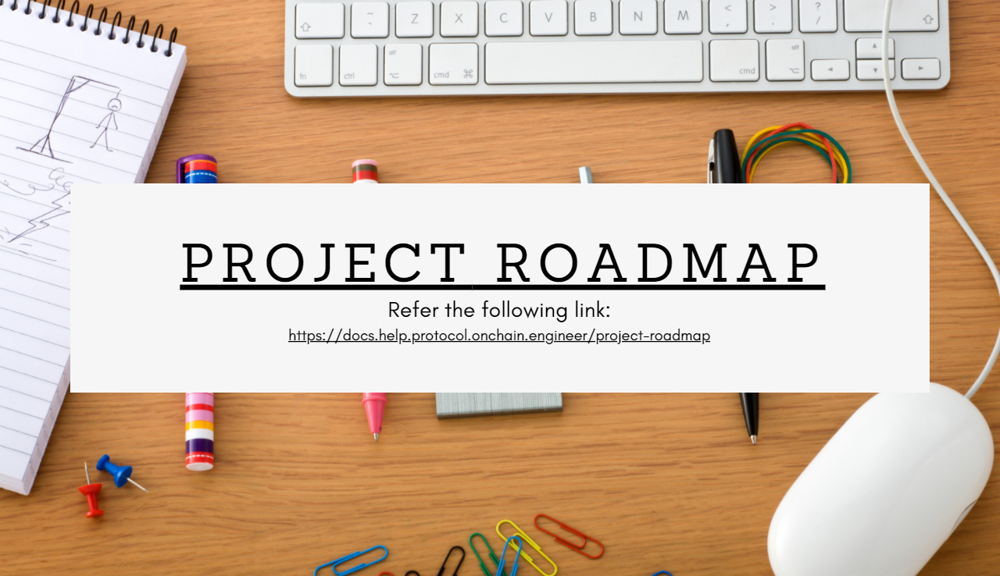

 

# Help Protocol - Building World's First Decentralized Community Empowering Network

## Contents

- [Submission or project name](#submission-or-project-name)
  - [Contents](#contents)
  - [Short description](#short-description)
    - [What's the problem?](##whats-the-problem)
    - [How can technology help?](##how-can-technology-help)
    - [The idea](#the-idea)
  - [Demo video](#demo-video)
  - [The architecture](#the-architecture)
  - [Long description](#long-description)
  - [Project roadmap](#project-roadmap)
  - [Getting started](#getting-started)
  - [Live demo](#live-demo)
  - [Built with](#built-with)
  - [Important Help Protocol Repositories](#Important-Help-Protocol-Repositories)
  - [Contributing](#contributing)
  - [Team](#team)
  - [License](#license)
  - [Acknowledgments](#acknowledgments)

## Short description

### What's the problem?

### How can technology help?

### The idea

## Demo video

## The architecture

## Long description

[More detail is available here](https://docs.help.protocol.onchain.engineer/)

## Project roadmap

Features Pending - 

 

## Getting started

To get started with Help Protocol - visit respective section in the project documentation at [Help Protocol Docs](https://docs.help.protocol.onchain.engineer/).
 
*OR*
 
To contribute do consider individual repositories in [Help Protocol](https://github.com/Help-Protocol) organization.

## Live demo

You can find a running application to test at [help-protocol.mybluemix.net](http://help-protocol.mybluemix.net/) or an alternate application is running at [help-protocol.onchain.engineer](http://help-protocol.onchain.engineer).

## Built with

- [IBM Cloud Foundry](https://www.ibm.com/cloud/cloud-foundry) - To deploy [Help Protocol Web App](http://help-protocol.mybluemix.net/)
- [ReactJs](https://reactjs.org/) - Front-End framework
- [CosmWasm](https://cosmwasm.com/) - To develop [Help Protocol Smart Contracts](https://github.com/Help-Protocol/help-contracts/)
- [Cosmmos SDK](https://docs.cosmos.network/) - Blockchain framework to develop [Help Protocol Smart Contracts](https://github.com/Help-Protocol/help-contracts/)
- [Tendermint Consensus](https://docs.tendermint.com/master/) - Help Protocol Consensus Engine
- [Terra Blockchain](https://www.terra.money/) - Blockchain Network for Help Protocol
- [Anchor Protocol](https://anchorprotocol.com/) - A savings protocol offering low-volatile yields on Terra stablecoin deposits

## Important Help Protocol Repositories

- [Help Station](https://github.com/Help-Protocol/help-station) - Repository for Help Protocol dApp
- [Help Protocol Smart Contracts](https://github.com/Help-Protocol/help-contracts) - Repository for Help Protocol Contracts
- [Help Protocol Docs](https://github.com/Help-Protocol/help-protocol-documentation) - Repository for Help Protocol documentation

## Contributing

Please read [CONTRIBUTING.md](CONTRIBUTING.md) for details on our code of conduct, and the process for submitting pull requests to us.

## Team

- [Pratyaksh Gupta](https://github.com/oscillator25)

## License

This project is licensed under the Apache 2 License - see the [LICENSE](LICENSE) file for details.

## Acknowledgments

- Based on [Billie Thompson's README template](https://gist.github.com/PurpleBooth/109311bb0361f32d87a2).

